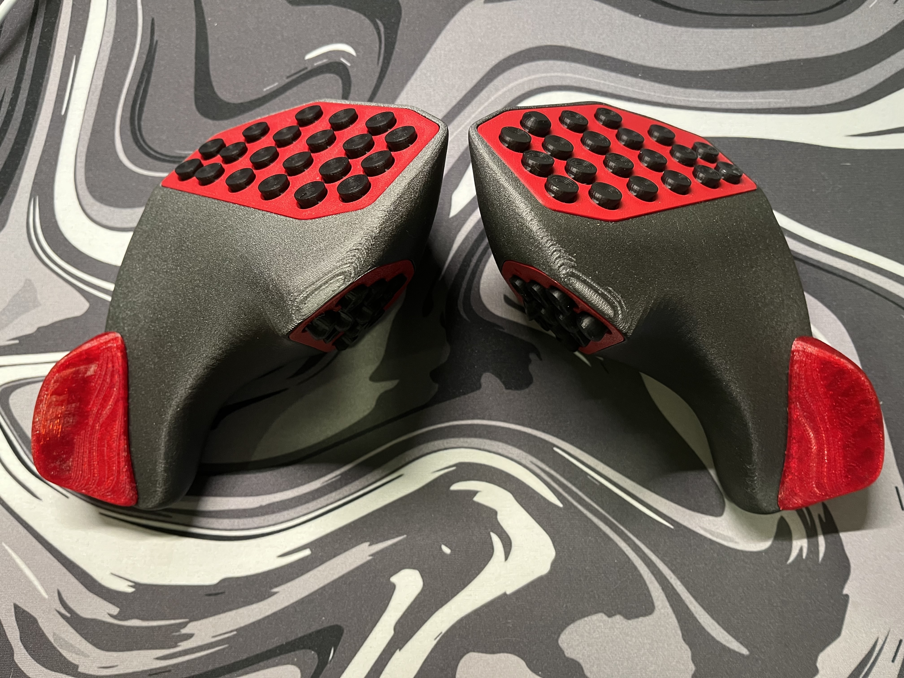
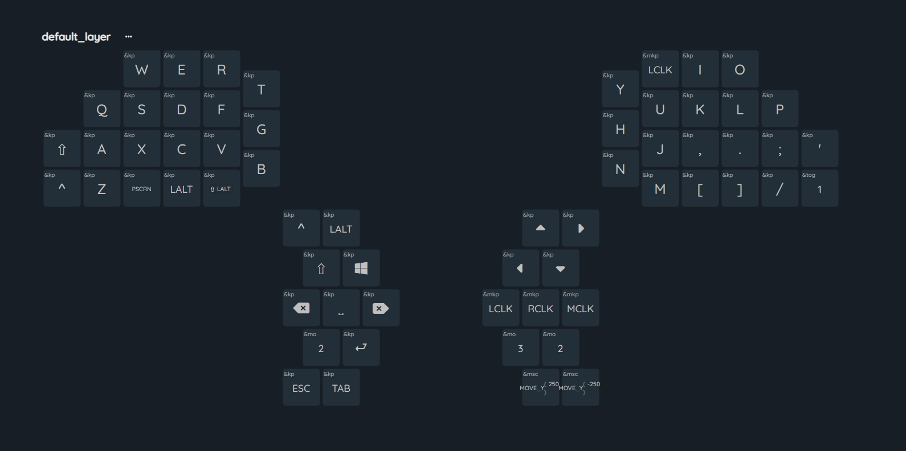
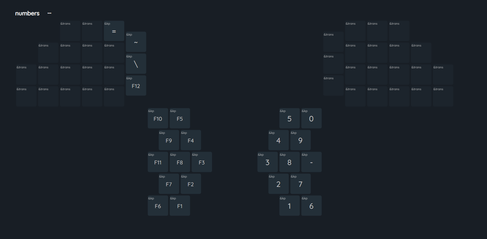
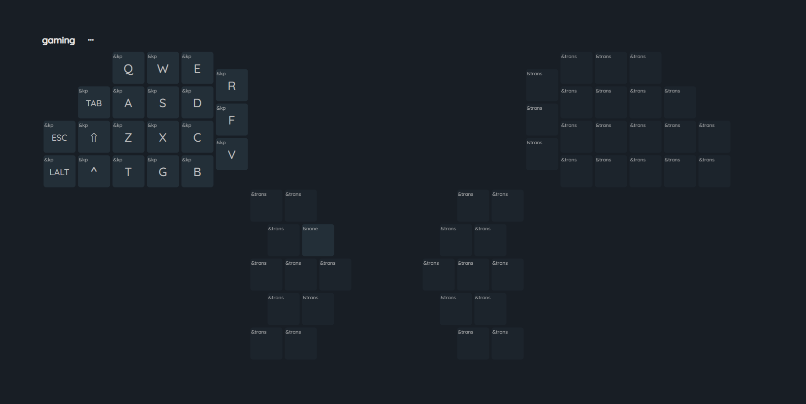

# Lynxware Cat
[Lynxware Cat](https://www.lynxware.org/) is an open-source input device designed for creating flexible and customizable control solutions, supporting keyboard, mouse, joystick, and gyroscope interfaces.

This repository contains a modified build of Lynxware Cat v0.30.

Summary of notable changes:
- Added wireless communication using Nordic ESB via dongle.
- Migrated hardware target from BPI Leaf to Nordic nRF52840 (Nice!Nano v2 clone).
- Replaced mouse sensor with PMW3610.
- Ported firmware to ZMK.

For the complete list of changes, see the [CHANGELOG](./docs/CHANGELOG.md).

## Images

More images are available in the [img](./img) directory.

## Keymap

Default layer

Numbers layer

Gaming layer

